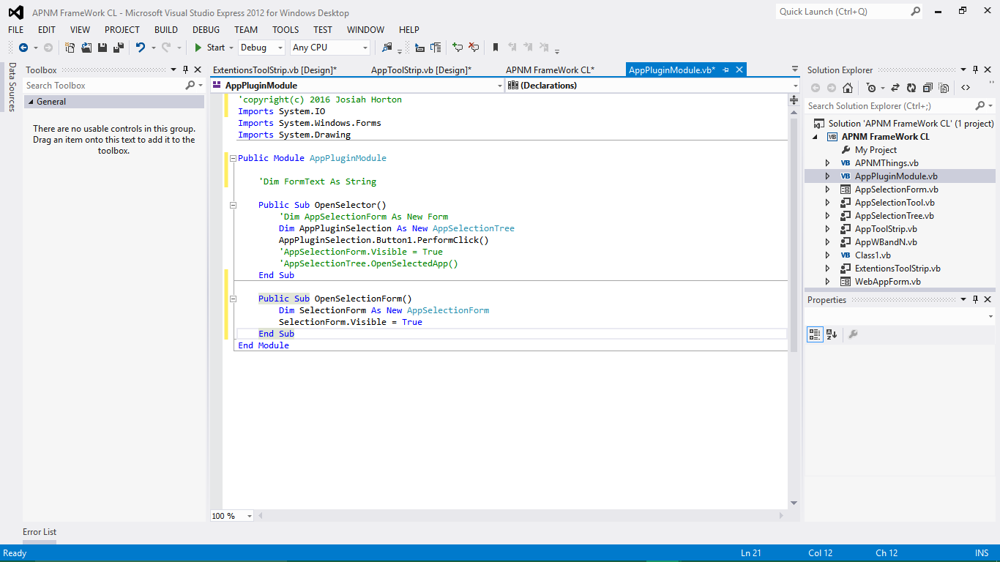

# APNM.NET How-To
The official instruction guide for [Editing](https://github.com/JTechMe/APNM-Framework/blob/master/APNM.NET%20How-To.md#editing-the-source), [Building](https://github.com/JTechMe/APNM-Framework/blob/master/APNM.NET%20How-To.md#building-the-source) and [Using](https://github.com/JTechMe/APNM-Framework/blob/master/APNM.NET%20How-To.md#using-apnmnet) the APNM.NET plugin project.
#
## Editing the Source
### Prerequisites
To edit the source code for the APNM.NET Framework you will need the following;
* Visual Studio 12 or Higher (Visual Studio 2015 is prefered)
* The source code for the .NET version of APNM found in the APNM.NET folder
* Adequate knowlage of Visual Basic.NET

### Setting up the Project
The project is extremely easy to set up. All you need to do is place the project files in a directory you will remember(i.e. your Projects folder in your documents) and open the .VPROJ file in Visual Studio.
### Editing the Project Code
Now you're ready to start editing the project code!
To start you off, lets open the AppPluginModule.vb file. The contents of this file as of version 1.0 are as follows;
```
Imports System.IO
Imports System.Windows.Forms
Imports System.Drawing

Public Module AppPluginModule

    Public Sub OpenSelector()
        'Dim AppSelectionForm As New Form
        Dim AppPluginSelection As New AppSelectionTree
        AppPluginSelection.Button1.PerformClick()
        'AppSelectionForm.Visible = True
        'AppSelectionTree.OpenSelectedApp()
    End Sub
End Module
```
#
Now we're going to add a Public Sub to the code below the OpenSelector Sub.
```
Public Sub MyFirstEdit()
      MessageBox.Show("This is my first edit to APNM.NET", "APNM.NET Framework", _
           MessageBoxButtons.OKCancel, MessageBoxIcon.Asterisk)
End Sub
```
What this will do is create a MessageBox that can be called from any project loaded with your build of the APNM.NET DLL. The code that would be used to call this MessageBox from another project would be ```APNM.AppPluginModule.MyFirstEdit```
### Changing your Version Number
Now that you've made your first edit you may want to change the build number. To do this we're going to open the Project Properties. Once the properties are open click Assembly Information. This is the information that the DLL file will be assigned to identify itself. Change the Assembly Version from 1.0.0.0 to 1.0.1.0 and the File>Save All.
## Building the Source
Now that you've made an edit or two and changed the assembly version, you're ready to build the DLL! To do this we're going to Build>Rebuild Solution. After this completes navigate to the project directory \bin\debug\ and you will find three files;
1. APNM FrameWork CL.dll
2. APNM FrameWork CL.pdb
3. APNM FrameWork CL.xml
The important file here is the 'APNM FrameWork CL.dll'. Now you've succesfully built the APNM.Net Framework!

## Using APNM.NET
At this point either you've built the DLL own your local machine or you've skipped straight to the good part!
To use the APNM.NET Framework in your .NET application you first must understand what this framework does. For this I refer you to the [README.md](https://github.com/JTechMe/APNM-Framework/blob/master/README.md) at the project's root.
Now that you understand what the pupose of this framework is you need to know the basics of using it in your project.
First, you need to add a reference to the framework in your project.
Next, open your ToolBox and right-click, select Choose Items, click Browse and select the DLL.
Now you need to add the code! The available (stable) commands are:
* ```APNM.AppPluginModule.OpenSelector```
* ```APNM.AppRoot =``` can be altered to equal a set directory such as the project forlder (an example is ```APNM.AppRoot = Environment.CurrentDirectory```)
* ```APNM.AppPluginModule.OpenSelectionForm()```

These are all the stable commands but more are available. To access them just play around with the ```APNM.``` reference and you'll find them. I will be adding more features soon, for a full list please refer to the [README.md](https://github.com/JTechMe/APNM-Framework/blob/master/README.md)
```
Copyright 2015 Josiah Horton

APNM Framework

   This Source Code Form is subject to the terms of the 
   General Open Control License, v. 1.0. If a copy of the GOC 
   was not distributed with this file, You can obtain one at 

   https://github.com/JTechMe/GOC-General-Open-Control-Licence-v1.0/
```
